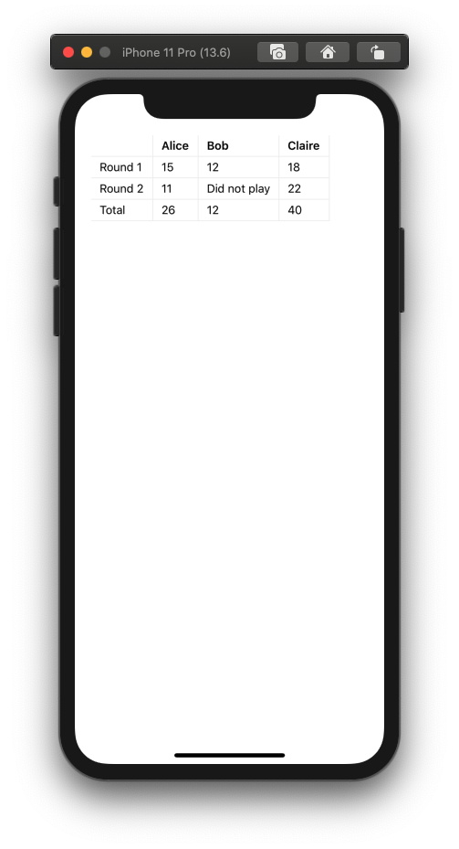

# React Native Gifted Table

The 0 dependency HTML-like approach to bring tables to React Native that do not rely on flex or hard-coded columns width.

## Installation

```
yarn add react-native-gifted-table
```

or

```
npm install react-native-gifted-table
```

## Usage

```jsx
import React from 'react'
import {
  View,
  Text,
  StyleSheet,
} from 'react-native'
import { Table, Row, Cell } from 'react-native-gifted-table'

const styles = StyleSheet.create({
  wrapper: {
    paddingVertical: 50,
    paddingHorizontal: 20,
  },
  table: {
    alignItems: 'flex-start',
  },
  cell: {
    paddingHorizontal: 10,
    paddingVertical: 4,
    borderRightColor: '#eee',
    borderRightWidth: 1,
  },
  row: {
    borderBottomWidth: 1,
    borderBottomColor: '#eee',
  },
  header: {
    fontWeight: '600',
  },
})

const MyComponent = () => (
  <View style={styles.wrapper}>
    <Table style={styles.table}>
      <Row style={styles.row}>
        <Cell style={styles.cell} />
        <Cell style={styles.cell} render={() => <Text style={styles.header}>Alice</Text>} />
        <Cell style={styles.cell} render={() => <Text style={styles.header}>Bob</Text>} />
        <Cell style={styles.cell} render={() => <Text style={styles.header}>Claire</Text>} />
      </Row>
      <Row style={styles.row}>
        <Cell style={styles.cell} render={() => <Text>Round 1</Text>} />
        <Cell style={styles.cell} render={() => <Text>15</Text>} />
        <Cell style={styles.cell} render={() => <Text>12</Text>} />
        <Cell style={styles.cell} render={() => <Text>18</Text>} />
      </Row>
      <Row style={styles.row}>
        <Cell style={styles.cell} render={() => <Text>Round 2</Text>} />
        <Cell style={styles.cell} render={() => <Text>11</Text>} />
        <Cell style={styles.cell} render={() => <Text>Did not play</Text>} />
        <Cell style={styles.cell} render={() => <Text>22</Text>} />
      </Row>
      <Row style={styles.row}>
        <Cell style={styles.cell} render={() => <Text>Total</Text>} />
        <Cell style={styles.cell} render={() => <Text>26</Text>} />
        <Cell style={styles.cell} render={() => <Text>12</Text>} />
        <Cell style={styles.cell} render={() => <Text>40</Text>} />
      </Row>
    </Table>
  </View>
)

export default MyComponent
```

> For large tables, you may want to wrap your table in scrollable components.



## Styling

No cosmetic styling is made by the library other than setting the width on the cells. It's up to you to provide `style` props to any of the `<Table />`, `<Row />` or `<Cell />` components if you want to customize your tables. There's no restrictions as to what styling properties you may use to the exception of `width` on `<Cell />`.

The library adjusts each `<Cell />`'s width to the largest cell in the column.

:warning: It is important that all of your rows contain the same number of cells. If you want to "skip" a cell, simply add an empty `<Cell />` as a placeholder. There is currently no way to have a cell span over multiple columns.


